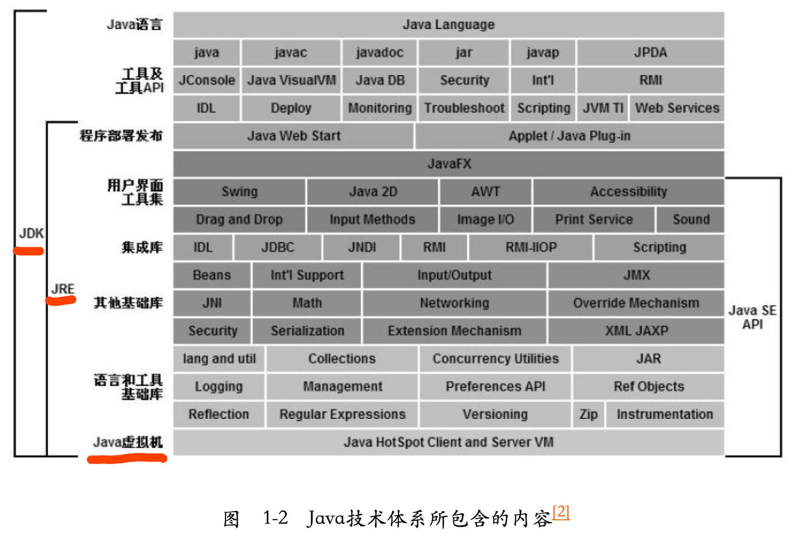

# 1. 什么是面向对象?

> 面向对象是一种思想, 万物皆对象

1. **面向对象的优点**
    1. 代码开发模块化，更易维护和修改。
    2. 代码复用性强。
    3. 增强代码的可靠性和灵活性。
    4. 增加代码的可读性。
2. **面向对象的特征**
    1. 封装
    2. 继承
    3. 多态
    4. 抽象

# 2. 重载和重写的区别?

1. **重写 override**
    1. 方法名、参数、返回值相同。
    2. 子类方法不能缩小父类方法的访问权限。
    3. 子类方法不能抛出比父类方法更多的异常(但子类方法可以不抛出异常)。
    4. 存在于父类和子类之间。
    5. 方法被定义为 `final` 不能被重写。
2. **重载 overload**
    1. 参数类型、个数、顺序至少有一个不相同。
    2. 不能重载只有返回值不同的方法名。
    3. 存在于父类和子类、同类中。
3. **Java 中，什么是构造方法？什么是构造方法重载？什么是拷贝构造方法？**
    1. 什么是构造方法?
        - 当新对象被创建的时候，构造方法会被调用。每一个类都有构造方法。在程序员没有给类提供构造方法的情况下，Java
          编译器会为这个类创建一个默认的构造方法。
    2. 什么是构造方法重载?
        - 为一个类创建多个构造方法。每一个构造方法必须有它自己唯一的参数列表。

# 3. JDK、JRE、JVM 分别是什么关系？

1. **JDK**
    1. JDK 即为 Java 开发工具包，包含编写 Java 程序所必须的编译、运行等开发工具以及 JRE。开发工具如：
        - 用于编译 Java 程序的 javac 命令。
        - 用于启动 JVM 运行 Java 程序的 Java 命令。
        - 用于生成文档的 Javadoc 命令。
        - 用于打包的 jar 命令等等。
2. **JRE**
    1. JRE 即为 Java 运行环境，提供了运行 Java 应用程序所必须的软件环境，包含有 Java 虚拟机（JVM）和丰富的系统类库。
3. **JVM**
    1. JVM 即为 Java 虚拟机，提供了字节码文件(`.class`)的运行环境支持。

​            

# 4. 什么是字节码？采用字节码的最大好处是什么？

1. **Java源代码的执行过程(编译与解释并存)**

    1. Java在机器和编译程序之间加入了一层抽象的虚拟机器, 这台虚拟的机器在任何平台上都提供给编译程序一个共同的接口。

    2. 编译程序只需要面向虚拟机, 生成虚拟机能够理解的代码, 然后由解释器来将虚拟机代码转换成特定系统的机器码执行,
       这种提供给虚拟机理解的代码叫做字节码(.class文件), 字节码只面向虚拟机。

    3. 各个平台的解释器不同, 但Java虚拟机的实现是相同的, 具体过程如下。

   ```html
   Java 源代码
   => 编译器  =>  JVM可执行的Java字节码(虚拟机指令)
   => JVM  => JVM中解释器 => 机器可执行的二进制机器码  => 程序运行
   ```

2. **采用字节码的好处**

    1. 在一定程度上解决了传统解释型语言执行效率低的问题，同时又保留了解释型语言可移植的特点。

# 5. Java中的基本数据类型

> Java 支持的数据类型包括基本数据类型和引用类型。

1. **基本数据类型**

    - 整数值型：`byte`、`short`、`int`、`long`
    - 字符型：`char`
    - 浮点类型：`float`、`double`
    - 布尔型：`boolean`
    - 整数型：默认 `int` 型，小数默认是 `double` 型。float 和 long 类型的必须加后缀。比如：`float f = 100f`

2. **引用类型**: 声明的变量是指该变量在内存中存储了一个引用地址，实体在堆中。

    - 引用类型包括类、接口、数组等。
    - 特别注意，String 是引用类型不是基本类型。

3. **什么是值传递和引用传递?**

    - 值传递: 针对基本数据类型, 传递的是变量的一个副本, 改变副本不影响原变量

      ```java
      int a = 1;
      private void test(int a) {
          a = a +1; 
      }
      // test方法内a=2, 方法外的a仍旧等于1
      ```

    - 引用传递，一般是对于对象型变量而言的，传递的是该对象地址的一个副本，并不是原对象本身。

      ```java
      Integer a = 1;
      private void test(int a) {
          a = a +1; 
      }
      // test方法内a=2, 方法外的a=2 
      ```

4. **是否可以在 static 环境中访问非 static 变量？**

    1. static变量在Java中是属于类的, 它在所有的实例中的值是一样的。当类被 Java 虚拟机载入的时候，会对 `static`
       变量进行初始化。如果代码尝试不用实例来访问非 `static` 的变量，编译器会报错，因为这些变量还没有被创建出来，还没有跟任何实例关联上。

5. **char 型变量中能不能存贮一个中文汉字?**

    1. char占2个字节, Java 默认采用 Unicode 编码，一个 Unicode 码是 16 位，所以一个 Unicode 码占两个字节，Java
       中无论汉字还是英文字母，都是用 Unicode 编码来表示的。所以，在 Java 中，char 类型变量可以存储一个中文汉字。

# 6. String、StringBuffer、StringBuilder 的区别？

1. **String**

    - 只读字符串，也就意味着 String 引用的字符串内容是不能被改变的。每次对 String 类型进行改变的时候，都会生成一个新的
      String 对象，然后将指针指向新的 String 对象。

2. **StringBuffer/StringBuilder**

    - 表示的字符串对象可以直接进行修改, 区别是StringBuffer的方法都用synchronized修饰, 保证了并发情况下的线程安全。
    - 相同情况下使用 StirngBuilder 相比使用 StringBuffer 仅能获得 10%~15% 左右的性能提升，但多线程不安全。

3. **对于三者使用的总结**

    1. 操作少量的数据 = String 。
    2. 单线程操作字符串缓冲区下操作大量数据 = StringBuilder 。
    3. 多线程操作字符串缓冲区下操作大量数据 = StringBuffer

4. **String s = new String("s")创建了几个对象**

    1. 若String池里没有 s 字符串, 则会创建2个对象, 先创建一个 s 字符串对象放在String池内, 碰到new 关键字再创建一个String对象,
       该对象指向String池中的 s 字符串

    2. 若String池里有s字符串, 则会创建1个对象, 碰到new关键字创建一个String对象, 指向String池里的 s 字符串

       ```java
       public class Test {
       
           public static void main(String[] args) {
               String temp1 = "s2";
               String temp2 = "s2";
               String s2 = new String("s2");
               System.out.println(temp1 == temp2);  // true  没有创建新对象, 直接用String池内的 "s2"
               System.out.println(temp1.equals(temp2)); // true 比较的是值
               System.out.println(s2 == temp2); // false new了一个新对象, 指向String池内的 "s2"
               System.out.println(s2.equals(temp1)); // true 比较的是值
           }
       }
       ```

5. **String为什么是不可变的?**

    1. 由`final`修饰

# 7. 什么是自动拆装箱?

> 自动装箱和拆箱, 是基本类型和引用类型之间的转换

1. **为什么要转换?**
    1. jdk5之前Collection类中无法直接放入基本类型(如int), 需要手动的转换为引用类型(Integer), 为了使代码更加简洁精炼。
2. **int与Integer区别?**
    1. int是基础数据类型, Integer是引用类型是int的包装类
    2. 当Integer a = 10, 相当于做了自动装箱, 自动装箱可以理解为调用了valueOf()方法
    3. Integer的缓存策略
     ```java
     public class Test {
      /**
          当调用valueOf方法或自动装箱时, 
          会判断当前的数值是否在IntegerCache.low(-128)~IntegerCache.high(127)之间
          1. 如果在这范围类, 会先尝试从缓存中取对应的包装类型对象
              1.2 如果没有获取到, 说明Integer是首次被调用, 首次调用时会初始化静态类IntegerCache, 
                  会将[-128,127]范围的Integer对象都进行缓存;
              1.3 如果获取到会直接返回对应的Integer缓存对象;
          2. 针对所有整数类型的类都会有这样的缓存机制
          3. 源码中有一段,
             String integerCacheHighPropValue = sun.misc.VM.getSavedProperty("java.lang.Integer.IntegerCache.high");
             可以通过 -XX:AutoBoxCacheMax=size 设置缓存区间的上限
      */
      public static void main(String[] args) {
          Integer integer1 = Integer.valueOf(4);
          Integer integer2 = 4;
          System.out.println(integer1 == integer2); // true

          integer1 = 4;
          integer2 = 4;
          System.out.println(integer1 == integer2); // true

          integer1 = 129;
          integer2 = 129;
          System.out.println(integer1 == integer2); // false
      }
     }
     ```


# 8. equals 与 == 的区别?
> 基础数据类型用==判断是否相等, 引用类型用==判断是否是同一个对象;
> equals方法是Object的成员函数, 有些类(如String)会覆盖(override) 这个方法，用于判断对象的等价性。

1. **如何在父类中为子类自动完成所有的 hashCode 和 equals 实现? 这么做有何优劣?**
   1. 父类的equals方法无法满足子类的所有需求, 比如Object类的equals()直接是==, 判断引用对象时比较的是是否是同一个对象, 
      大多数场景需要比较的是具体的属性值是否相等。
   2. 在如集合键值对类中, 如果重写了equals()需要重写hashCode(), 如果只重写equals()
      1. 当2个值用重写后的equals()判断是相等的, 但用hashCode()计算的值不同, 会导致将相同对象存储在散列表中不同的桶中, 
         当查找改该元素时无法查找到; 如下示例
      ```java
         class Person {
           private String name;
           private int age;
   
           Person(String name, int age) {
              this.name = name;
              this.age = age;
           }

           @Override
           public boolean equals(Object o) {
              if (this == o) return true;
              if (o == null || getClass() != o.getClass()) return false;
              Person person = (Person) o;
              return age == person.age && name.equals(person.name);
           }
           // hashCode method is not overridden
        }
        public class Main {
             public static void main(String[] args) {
             Person p1 = new Person("John", 25);
             Person p2 = new Person("John", 25);
             // p1 p2用equals方法比较相等, 但是由于hashCode不一致导致无法获取到   
             Map<Person, String> map = new HashMap<>();
             map.put(p1, "Person 1");
             System.out.println(map.get(p2)); // Output: null
        }
      }
      ```
2. **可能存在2个不相等的对象有相同的hashCode, 称之为哈希碰撞**


# 9. final、finally、finalize 的区别？
1. final, 修饰符关键字
   1. 如果一个类被声明为 final, 意味着它不能再派生出新的子类, 不能作为父类被继承。
   2. 将变量或方法声明为 final, 可以保证它们在使用中不被改变。被声明为 final 的变量必须在声明时给定初值, 而在以后的引用中只能读取, 不可修改。
2. finally, 抛出对应的异常时可以进入finally块
   1. 当finally语句块中发生异常, 或者当前线程死亡等情况finally代码块不会执行
3. finalize, 方法名
   1. Java 允许使用 #finalize() 方法，在垃圾收集器将对象从内存中清除出去之前做必要的清理工作。这个方法是由垃圾收集器在确定这个对象没有被引用时对这个对象调用的。
   2. 它是在 Object 类中定义的，因此所有的类都继承了它。
   3. 子类覆盖 finalize() 方法，以整理系统资源或者执行其他清理工作。
4. **String 类能被继承吗，为什么?**
   1. 不能, 因为String是final修饰


# 10. 抽象类和接口有什么区别？
1. **从设计的层面来说, 抽象是对类的抽象, 是一种模版设计, 接口是行为的抽象, 是一种行为规范**
   1. 抽象类的方法可以是具体的也可以是抽象的, 接口的方法只能是抽象的
   2. 类可以实现多个接口, 只能继承一个抽象类; 抽象类可以不实现接口或抽象类中的所有方法
   3. 接口中声明的变量默认都是final的, 抽象类可以包含非final的变量
   4. 接口和冲向类都不能被实例化
2. **继承和组合的区别在哪?**
   1. 继承指的是一个类继承另外一个类(或者接口和接口之间), 对父类的扩展
   2. 组合(建议看书籍或者视频)


# 11. 讲讲类的实例化顺序？
1. 初始化顺序如下：
   1. 初始化父类静态变量
   2. 初始化父类静态代码块
   3. 初始化子类静态变量
   4. 初始化子类静态代码块
   5. 初始化父类非静态变量
   6. 初始化父类构造函数
   7. 初始化子类非静态变量
   8. 初始化子类构造函数


# 12. 什么是内部类?
> 就是在一个类、接口或者方法的内部创建另一个类。
1. **内部类的作用是什么?**
   1. 内部类提供了更好的封装, 除了该外围类, 其他类都不能访问。
2. **Anonymous Inner Class(匿名内部类)是否可以继承其它类? 是否可以实现接口?**
   1. 可以继承其他类或实现其他接口, 在 Java 集合的流式操作中, 我们常常这么干。
