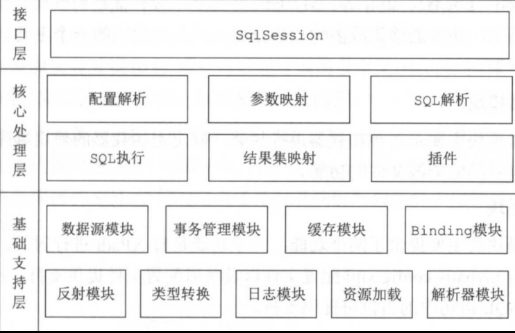

# 一、MyBatis源码整体架构

> 整体架构分为三层, 接口层 核心处理层 基础支持层

### 1. 基础支持层

> 基础支持层, 包含整个MyBatis的基础模块, 为核心处理层提供良好的支持

#### 1.1 反射模块

对应 reflection 包

-  对Java的原生反射进行了封装并提供更加简洁的API

#### 1.2 类型模块

对应 type 包

- 为配置文件提供了别名机制
- 实现jdbc类型与java类型的转换

#### 1.3 日志模块

对应 logging 包

- 提供详细的日志记录
- 支持多种第三方日志框架的集成

#### 1.4 IO模块

对应io包

- 对类加载器进行封装, 确定类加载器的使用顺序
- 提供了加载类文件以及其它资源文件加载的能力

#### 1.5 解析器模块

对应parsing模块

- 对 xPath进行封装, 为MyBatis初始化时解析mybatis-config,xml配置文件以及xml映射文件提供支持
  - xpath文档 https://www.w3school.com.cn/xpath/index.asp#google_vignette
- 为处理动态sql语句中的占位符提供支持

#### 1.6 数据源模块

对应 datasource 模块

- 自身提供相应的数据源实现
- 也支持第三方数据源的集成

#### 1.7 事务模块

对应 transaction 模块

- 对数据库的事务进行了抽象, 其自身提供了相应的事务接口和简单实现

#### 1.8 缓存模块

对应 cache 模块

- MyBatis中的一二级缓存均依赖基础包中的cache包, 注意当一二级缓存数据过大会影响MyBatis其它缓存的性能

#### 1.9 Binding模块

对应 binding 模块

- 将用户自定义的Mapper接口与对应的SQL映射文件进行绑定, 通过动态代理生成接口实现类

#### 1.10 注解模块

对应 annotation 包

- 提供注解的实现方式替代xml文件

#### 1.11 异常模块

对应 exceptions 包

- 定义了 MyBatis 专有的 PersistenceException 和 TooManyResultsException 异常

### 2. 核心处理层

> 实现了mybatis的核心处理流程, 包括MyBatis的初始化以及完成一次数据库操作的涉及的全部流程

#### 2.1 配置解析

对应 builder 和 mapping 模块, 前者为解析过程, 后者为SQL操作解析后的映射 

- 在 MyBatis 初始化过程中，会加载 `mybatis-config.xml` 配置文件、映射配置文件以及 Mapper 接口中的注解信息，解析后的配置信息会形成相应的对象并保存到 Configuration 对象中
- 之后，利用该 Configuration 对象创建 SqlSessionFactory对象。待 MyBatis 初始化之后，开发人员可以通过初始化得到 SqlSessionFactory 创建 SqlSession 对象并完成数据库操作

#### 2.2 SQL解析

