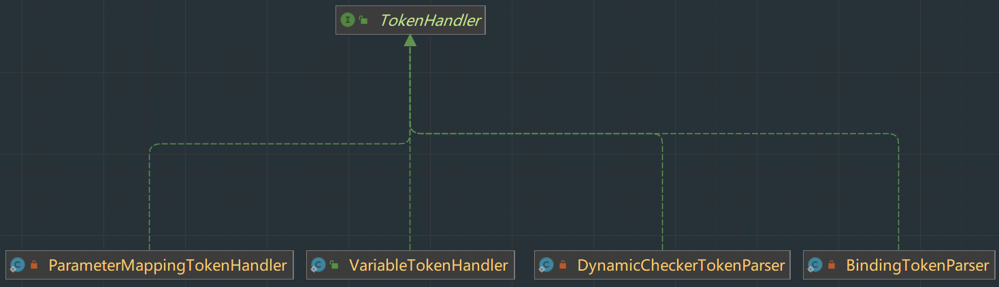

# 一、MyBatis源码解析器

### 1. XPathParser

> 基于 Java **XPath** 解析器，用于解析 MyBatis `mybatis-config.xml` 和 `**Mapper.xml` 等 XML 配置文件。所在包: org.apache.ibatis.parsing

#### 1.1 成员属性

```java
  /**
   * XML Document 对象
   */
  private final Document document;
  /**
   * 是否校验
   */
  private boolean validation;
  /**
   * XML 实体解析器
   */
  private EntityResolver entityResolver;
  /**
   * 变量 Properties 对象
   */
  private Properties variables;
  /**
   * Java XPath 对象
   */
  private XPath xpath;
```

- document:  

  - XML 被解析后，生成的 `org.w3c.dom.Document` 对象

- validation:  

  - 是否校验 XML, 一般为 `true`

- entityResolver:  

  - XML 实体解析器, 默认情况下, 对 XML 进行校验时, 会基于 XML 文档开始位置指定的 DTD 文件或 XSD 文件, 由于需要网络加载, MyBatis 自定义了 EntityResolver 的实现，达到使用**本地** DTD 文件

- xpath:  

  - 用于查询XML中的节点和元素(https://www.yiibai.com/java_xml/java_xpath_parse_document.html)

- variables:  Properties对象, 用来替换需要动态配置的属性值

  ```xml
  <dataSource type="POOLED">
    <property name="driver" value="${driver}"/>
    <property name="url" value="${url}"/>
    <property name="username" value="${username}"/>
    <property name="password" value="${password}"/>
  </dataSource>
  <--可以用properties文件,也可以使用properties标签,如下用username替换占位符-->
  
  <properties resource="org/mybatis/example/config.properties">
    <property name="username" value="dev_user"/>
    <property name="password" value="F2Fa3!33TYyg"/>
  </properties>
  ```


#### 1.2 构造方法

以其中一个构造方法为例: 

```java
  /**
   * 构造 XPathParser 对象
   *
   * @param xml XML 文件地址
   * @param validation 是否校验 XML
   * @param variables 变量 Properties 对象
   * @param entityResolver XML 实体解析器
   */
  public XPathParser(String xml, boolean validation, Properties variables, EntityResolver entityResolver) {
    commonConstructor(validation, variables, entityResolver);
    this.document = createDocument(new InputSource(new StringReader(xml)));
  }
```

- 调用 #commonConstructor(boolean validation, Properties variables, EntityResolver entityResolver)

  - 调用共用的构造方法

    ```java
    private void commonConstructor(boolean validation, Properties variables, EntityResolver entityResolver) {
        this.validation = validation;
        this.entityResolver = entityResolver;
        this.variables = variables;
        // 创建 XPathFactory 对象
        XPathFactory factory = XPathFactory.newInstance();
        this.xpath = factory.newXPath();
      }
    ```

- 调用 #createDocument(InputSource inputSource)

  - 将xml文件解析成Document对象

    ```java
      /**
       * 创建 Document 对象
       *
       * @param inputSource XML 的 InputSource 对象
       * @return Document 对象
       */
      private Document createDocument(InputSource inputSource) {
        // important: this must only be called AFTER common constructor
        try {
          // 1. 创建 DocumentBuilderFactory 对象
          DocumentBuilderFactory factory = DocumentBuilderFactory.newInstance();
          factory.setFeature(XMLConstants.FEATURE_SECURE_PROCESSING, true);
          factory.setValidating(validation); // 设置是否验证xml
    
          factory.setNamespaceAware(false);
          factory.setIgnoringComments(true);
          factory.setIgnoringElementContentWhitespace(false);
          factory.setCoalescing(false);
          factory.setExpandEntityReferences(false);
    
          // 2. 创建 DocumentBuilder 对象
          DocumentBuilder builder = factory.newDocumentBuilder();
          builder.setEntityResolver(entityResolver); // 设置实体解析器
          builder.setErrorHandler(new ErrorHandler() { 
            @Override
            public void error(SAXParseException exception) throws SAXException {
              throw exception;
            }
    
            @Override
            public void fatalError(SAXParseException exception) throws SAXException {
              throw exception;
            }
    
            @Override
            public void warning(SAXParseException exception) throws SAXException {
              // NOP
            }
          });
          // 3. 解析 xml 文件
          return builder.parse(inputSource);
        } catch (Exception e) {
          throw new BuilderException("Error creating document instance.  Cause: " + e, e);
        }
      }
    ```


#### 1.3 eval方法族

> XPathParser 提供了一系列的 #eval* 方法，用于获得 Boolean、Short、Integer、Long、Float、Double、String、Node 类型的元素或节点的“值”, 都是基于 \#evaluate(String expression, Object root, QName returnType)

```java
/**
   * 获得指定元素或节点的值
   *
   * @param expression 表达式
   * @param root 指定节点
   * @param returnType 返回类型
   * @return 值
   */
  private Object evaluate(String expression, Object root, QName returnType) {
    try {
      return xpath.evaluate(expression, root, returnType);
    } catch (Exception e) {
      throw new BuilderException("Error evaluating XPath.  Cause: " + e, e);
    }
  }
```

- 调用 xpath 的 evaluate(String expression, Object item, QName returnType) 方法, 获得指定元素或节点的值

##### 1.3.1 eval 元素

> eval 元素的方法，用于获得 Boolean、Short、Integer、Long、Float、Double、String 类型的**元素**的值, 以String为例

```java
  public String evalString(Object root, String expression) {
    // 1. 获取值, XPathConstants.STRING 表示返回的值是String
    String result = (String) evaluate(expression, root, XPathConstants.STRING);
    // 2. 基于 variables 替换动态值, 如果 result 为动态值, mybatis如何替换掉xml中的动态值的实现
    return PropertyParser.parse(result, variables);
  }
```

##### 1.3.2 eval节点

> eval 元素的方法，用于获得 Node 类型的**节点**的值

```java
public List<XNode> evalNodes(String expression) {
    return evalNodes(document, expression);
  }

  public List<XNode> evalNodes(Object root, String expression) {
    // 1. 获取 node数组, 将返回结果转为XNode对象, 完成动态值的替换
    List<XNode> xnodes = new ArrayList<>();
    NodeList nodes = (NodeList) evaluate(expression, root, XPathConstants.NODESET);
    for (int i = 0; i < nodes.getLength(); i++) {
      xnodes.add(new XNode(this, nodes.item(i), variables));
    }
    return xnodes;
  }

  public XNode evalNode(String expression) {
    return evalNode(document, expression);
  }

  public XNode evalNode(Object root, String expression) {
    // 获取单个 node节点
    Node node = (Node) evaluate(expression, root, XPathConstants.NODE);
    if (node == null) {
      return null;
    }
    return new XNode(this, node, variables);
  }
```


#### 1.4 XMLMapperEntityResolver

> 实现 EntityResolver 接口，MyBatis 自定义 EntityResolver 实现类，用于加载本地的 `mybatis-3-config.dtd` 和 `mybatis-3-mapper.dtd` 这两个 DTD 文件, 所在包 org.apache.ibatis.builder.xml

```java
public class XMLMapperEntityResolver implements EntityResolver {

  private static final String IBATIS_CONFIG_SYSTEM = "ibatis-3-config.dtd";
  private static final String IBATIS_MAPPER_SYSTEM = "ibatis-3-mapper.dtd";
  private static final String MYBATIS_CONFIG_SYSTEM = "mybatis-3-config.dtd";
  private static final String MYBATIS_MAPPER_SYSTEM = "mybatis-3-mapper.dtd";

  /**
   * 本地 mybatis-config.dtd 文件
   */
  private static final String MYBATIS_CONFIG_DTD = "org/apache/ibatis/builder/xml/mybatis-3-config.dtd";
  /**
   * 本地 mybatis-3-mapper.dtd 文件
   */
  private static final String MYBATIS_MAPPER_DTD = "org/apache/ibatis/builder/xml/mybatis-3-mapper.dtd";

  /**
   * Converts a public DTD into a local one.
   *
   * @param publicId
   *          The public id that is what comes after "PUBLIC"
   * @param systemId
   *          The system id that is what comes after the public id.
   *
   * @return The InputSource for the DTD
   *
   * @throws org.xml.sax.SAXException
   *           If anything goes wrong
   */
  @Override
  public InputSource resolveEntity(String publicId, String systemId) throws SAXException {
    try {
      if (systemId != null) {
        String lowerCaseSystemId = systemId.toLowerCase(Locale.ENGLISH);
        // 本地 mybatis-config.dtd 文件
        if (lowerCaseSystemId.contains(MYBATIS_CONFIG_SYSTEM) || lowerCaseSystemId.contains(IBATIS_CONFIG_SYSTEM)) {
          return getInputSource(MYBATIS_CONFIG_DTD, publicId, systemId);
        }
        // 本地 mybatis-3-mapper.dtd 文件
        if (lowerCaseSystemId.contains(MYBATIS_MAPPER_SYSTEM) || lowerCaseSystemId.contains(IBATIS_MAPPER_SYSTEM)) {
          return getInputSource(MYBATIS_MAPPER_DTD, publicId, systemId);
        }
      }
      return null;
    } catch (Exception e) {
      throw new SAXException(e.toString());
    }
  }

  /**
   * 读取文件
   */
  private InputSource getInputSource(String path, String publicId, String systemId) {
    InputSource source = null;
    if (path != null) {
      try {
        InputStream in = Resources.getResourceAsStream(path);
        source = new InputSource(in);
        source.setPublicId(publicId);
        source.setSystemId(systemId);
      } catch (IOException e) {
        // ignore, null is ok
      }
    }
    return source;
  }
}
```


#### 1.5 GenericTokenParser

> **通用**的 Token 解析器, 解析openToken开头closeToken结尾的Token, 所在包 org.apache.ibatis.parsing

```java
public class GenericTokenParser {

  /**
   * 开始的Token字符串
   */
  private final String openToken;
  /**
   * 结束的Token字符串
   */
  private final String closeToken;
  private final TokenHandler handler;

  public GenericTokenParser(String openToken, String closeToken, TokenHandler handler) {
    this.openToken = openToken;
    this.closeToken = closeToken;
    this.handler = handler;
  }

  public String parse(String text) {
    if (text == null || text.isEmpty()) {
      return "";
    }
    // search open token
    // 寻找开始的 openToken 的位置
    int start = text.indexOf(openToken);
    if (start == -1) {
      return text;
    }
    char[] src = text.toCharArray();
    int offset = 0; // 其实查找位置
    // 结果
    final StringBuilder builder = new StringBuilder();
    StringBuilder expression = null; // 匹配到 openToken 和 closeToken之间的表达式
    // 循环匹配
    do {
      if (start > 0 && src[start - 1] == '\\') {
        // this open token is escaped. remove the backslash and continue.
        // openToken前面的字符是转义字符: \, 忽略
        // 添加 [offset, start - offset - 1] 和 openToken 的内容，添加到 builder 中
        builder.append(src, offset, start - offset - 1).append(openToken);
        // 修改 offset
        offset = start + openToken.length();
        // 非转义字符
      } else {
        // found open token. let's search close token.
        // 创建/重置 expression 对象
        if (expression == null) {
          expression = new StringBuilder();
        } else {
          expression.setLength(0);
        }
        // 添加 offset 和 openToken 之间的内容，添加到 builder 中
        builder.append(src, offset, start - offset);
        // 修改 offset
        offset = start + openToken.length();
        // 寻找结束的closeToken的位置
        int end = text.indexOf(closeToken, offset);
        while (end > -1) {
          // 转义
          if ((end <= offset) || (src[end - 1] != '\\')) {
            expression.append(src, offset, end - offset);
            break;
          }
          // this close token is escaped. remove the backslash and continue.
          // 因为 endToken 前面一个位置是 \ 转义字符，所以忽略 \
          // 添加 [offset, end - offset - 1] 和 endToken 的内容，添加到 builder 中
          expression.append(src, offset, end - offset - 1).append(closeToken);
          offset = end + closeToken.length();
          end = text.indexOf(closeToken, offset);
        }
        // 拼接内容
        if (end == -1) {
          // close token was not found.
          // closeToken未找到, 直接拼接
          builder.append(src, start, src.length - start);
          // 修改 offset
          offset = src.length;
        } else {
          // closeToken找到, 将expression提交给handler处理, 结果添加到builder中
          builder.append(handler.handleToken(expression.toString()));
          // 修改offset
          offset = end + closeToken.length();
        }
      }
      // 继续, 寻找开始的openToken的位置
      start = text.indexOf(openToken, offset);
    } while (start > -1);
    // 拼接剩余部分
    if (offset < src.length) {
      builder.append(src, offset, src.length - offset);
    }
    return builder.toString();
  }
}
```

 

#### 1.6 PropertyParser

> 动态属性解析器, 所在包 org.apache.ibatis.parsing

```java
  /**核心代码**/
  // 私有, 进制构造该对象
  private PropertyParser() {
    // Prevent Instantiation
  }

  /**
   * 基于 variables 变量，替换 string 字符串中的动态属性，并返回结果
   */
  public static String parse(String string, Properties variables) {
    // 1. 创建 VariableTokenHandler 对象
    VariableTokenHandler handler = new VariableTokenHandler(variables);
    // 2. 创建 GenericTokenParser 对象, 实现解析自定义值替换逻辑 ${}
    GenericTokenParser parser = new GenericTokenParser("${", "}", handler);
    // 3. 执行解析
    return parser.parse(string);
  }
```


#### 1.7 TokenHandler

> Token处理器接口

```java
public interface TokenHandler {

  /**
   * 处理Token
   */
  String handleToken(String content);
}
```



##### 1.7.1 VariableTokenHandler

> PropertyParser 的内部静态类，变量 Token 处理器   

- 构造方法

  ```java
     /**
       * 变量 Properties 对象
       */
      private final Properties variables;
      /**
       * 是否开启默认值功能。默认为 {@link #ENABLE_DEFAULT_VALUE}
       */
      private final boolean enableDefaultValue;
      /**
       * 默认值的分隔符。默认为 {@link #KEY_DEFAULT_VALUE_SEPARATOR} ，即 ":" 。
       */
      private final String defaultValueSeparator;
  
      private VariableTokenHandler(Properties variables) {
        this.variables = variables;
        this.enableDefaultValue = Boolean.parseBoolean(getPropertyValue(KEY_ENABLE_DEFAULT_VALUE, ENABLE_DEFAULT_VALUE));
        this.defaultValueSeparator = getPropertyValue(KEY_DEFAULT_VALUE_SEPARATOR, DEFAULT_VALUE_SEPARATOR);
      }
  
      private String getPropertyValue(String key, String defaultValue) {
        return variables == null ? defaultValue : variables.getProperty(key, defaultValue);
      }
  ```

##### 1.7.2 HandleToken

```java
@Override
    public String handleToken(String content) {
      if (variables != null) {
        String key = content;
        // 开启默认值功能
        if (enableDefaultValue) {
          final int separatorIndex = content.indexOf(defaultValueSeparator);
          String defaultValue = null;
          if (separatorIndex >= 0) {
            key = content.substring(0, separatorIndex);
            defaultValue = content.substring(separatorIndex + defaultValueSeparator.length());
          }
          // 有默认值, 优先替换, 不存在则返回默认值
          if (defaultValue != null) {
            return variables.getProperty(key, defaultValue);
          }
        }
        // 未开启默认值功能, 直接替换
        if (variables.containsKey(key)) {
          return variables.getProperty(key);
        }
      }
      // 无 variables, 直接返回
      return "${" + content + "}";
    }
  }
```

