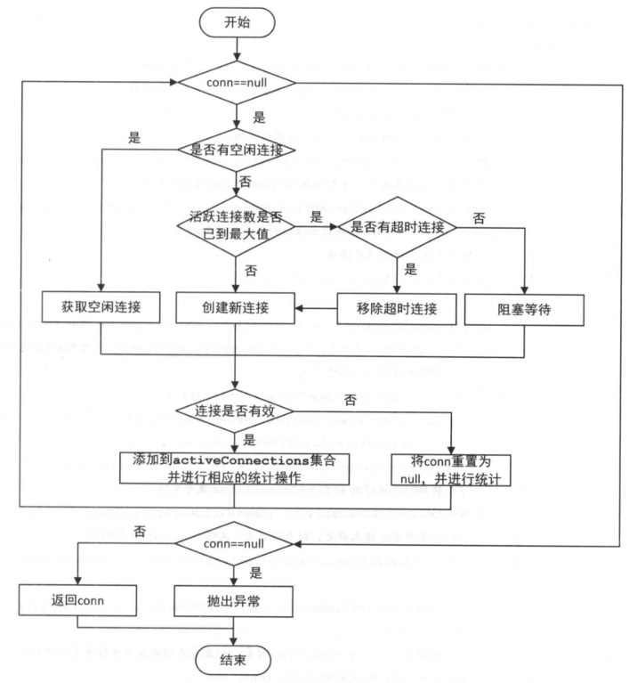
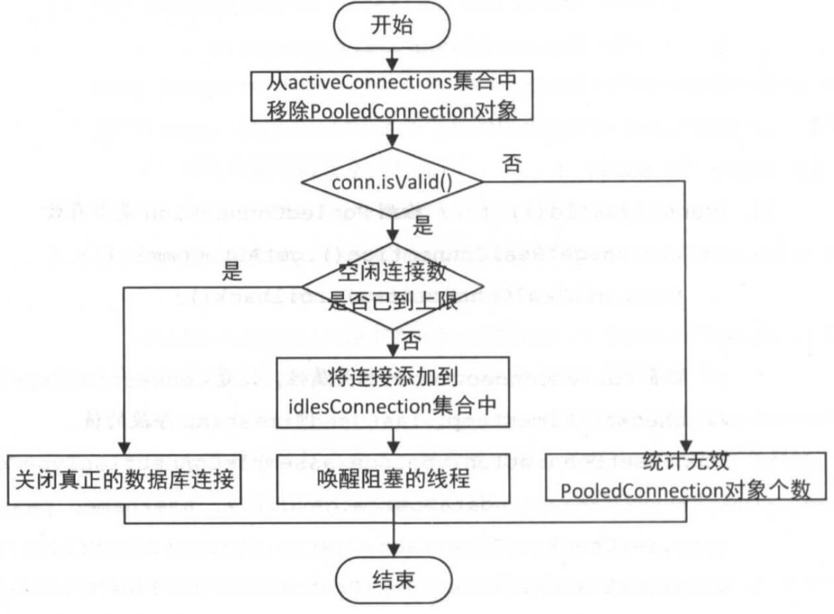

# 一、MyBatis源码之数据源模块

> MyBatis **自身提供了相应的数据源实现，当然 MyBatis 也提供了与第三方数据源集成的接口，这些功能都位于数据源模块之中**


### 1. DataSourceFactory

> javax.sql.DataSource 工厂接口, 所在包: org.apache.ibatis.datasource.DataSourceFactory

```java
public interface DataSourceFactory {

  /**
   * 设置 DataSource 对象的属性
   */
  void setProperties(Properties props);

  /**
   * 设置 DataSource 对象
   */
  DataSource getDataSource();

}
```


#### 1.1 UnpooledDataSourceFactory

> 实现 DataSourceFactory 接口，非池化的 DataSourceFactory 实现类, 非池化即不使用连接池技术管理数据库连接的数据源, 无连接复用机制, 每次连接都需要通过数据库驱动新建一个数据库连接, 简单性能不高, 所在包: org.apache.ibatis.datasource.unpooled.UnpooledDataSourceFactory

- 构造方法

  ```java
    private static final String DRIVER_PROPERTY_PREFIX = "driver.";
    private static final int DRIVER_PROPERTY_PREFIX_LENGTH = DRIVER_PROPERTY_PREFIX.length();
  
    /**
     * DataSource对象
     */
    protected DataSource dataSource;
    
    public UnpooledDataSourceFactory() {
      // 创建 UnpooledDataSource 对象
      this.dataSource = new UnpooledDataSource();
    }
  ```

- getDataSource

- 方法

  ```java
    @Override
    public DataSource getDataSource() {
      return dataSource;
    }
  ```

- setProperties方法

  ```java
    @Override
    public void setProperties(Properties properties) {
      Properties driverProperties = new Properties();
      // 创建 datasource 对应的 MetaObject对象
      MetaObject metaDataSource = SystemMetaObject.forObject(dataSource);
      // 遍历 properties 属性
      for (Object key : properties.keySet()) {
        String propertyName = (String) key;
        // 初始化到 driverProperties 和 MetaObject 中
        if (propertyName.startsWith(DRIVER_PROPERTY_PREFIX)) {
          String value = properties.getProperty(propertyName);
          // 初始化到 driverProperties
          driverProperties.setProperty(propertyName.substring(DRIVER_PROPERTY_PREFIX_LENGTH), value);
        } else if (metaDataSource.hasSetter(propertyName)) {
          String value = (String) properties.get(propertyName);
          // 将字符串转换为对应的属性类型
          Object convertedValue = convertValue(metaDataSource, propertyName, value);
          // 初始化到 MetaObject 中
          metaDataSource.setValue(propertyName, convertedValue);
        } else {
          throw new DataSourceException("Unknown DataSource property: " + propertyName);
        }
      }
      // 设置 properties 到 MetaObject 中
      if (driverProperties.size() > 0) {
        metaDataSource.setValue("driverProperties", driverProperties);
      }
    }
  
    /**
     * 将字符串转为对应属性的类型
     */
    private Object convertValue(MetaObject metaDataSource, String propertyName, String value) {
      Object convertedValue = value;
      // 获得该属性的 setting 方法的参数类型
      Class<?> targetType = metaDataSource.getSetterType(propertyName);
      if (targetType == Integer.class || targetType == int.class) {
        convertedValue = Integer.valueOf(value);
      } else if (targetType == Long.class || targetType == long.class) {
        convertedValue = Long.valueOf(value);
      } else if (targetType == Boolean.class || targetType == boolean.class) {
        convertedValue = Boolean.valueOf(value);
      }
      return convertedValue;
    }
  ```


#### 1.2 PooledDataSourceFactory

> 继承 UnpooledDataSourceFactory 类，池化的 DataSourceFactory 实现类, 所在包: org.apache.ibatis.datasource.pooled.PooledDataSourceFactory

```java
public class PooledDataSourceFactory extends UnpooledDataSourceFactory {

  public PooledDataSourceFactory() {
	// 多了许多配置项 PooledDataSource 
    this.dataSource = new PooledDataSource();
  }

}
```


#### 1.3 JndiDataSourceFactory

> 实现 DataSourceFactory 接口，基于 JNDI 的 DataSourceFactory 实现类, 这个数据源的实现是为了能在如 EJB 或应用服务器这类容器中使用，容器可以集中或在外部配置数据源，然后放置一个 JNDI 上下文的引用, 所在包: org.apache.ibatis.datasource.jndi.JndiDataSourceFactory

- 构造方法

  ```java
  // 初始化在set方法中 不同于 UnpooledDataSourceFactory 和 PooledDataSourceFactory 
  private DataSource dataSource;
  ```

- getDataSource

  ```java
    @Override
    public DataSource getDataSource() {
      return dataSource;
    }
  ```

- setProperties

  ```java
    public static final String INITIAL_CONTEXT = "initial_context";
    public static final String DATA_SOURCE = "data_source";
    public static final String ENV_PREFIX = "env.";
  
    @Override
    public void setProperties(Properties properties) {
      try {
        InitialContext initCtx;
        // 1.获得系统 Properties 对象
        Properties env = getEnvProperties(properties);
        // 2. 创建 InitialContext 对象
        if (env == null) {
          initCtx = new InitialContext();
        } else {
          initCtx = new InitialContext(env);
        }
  
        // 从 InitialContext 上下文中，获取 DataSource 对象
        if (properties.containsKey(INITIAL_CONTEXT) && properties.containsKey(DATA_SOURCE)) {
          Context ctx = (Context) initCtx.lookup(properties.getProperty(INITIAL_CONTEXT));
          dataSource = (DataSource) ctx.lookup(properties.getProperty(DATA_SOURCE));
        } else if (properties.containsKey(DATA_SOURCE)) {
          dataSource = (DataSource) initCtx.lookup(properties.getProperty(DATA_SOURCE));
        }
  
      } catch (NamingException e) {
        throw new DataSourceException("There was an error configuring JndiDataSourceTransactionPool. Cause: " + e, e);
      }
    }
  ```


### 2. DataSource

> 该接口可衍生数据连接池、分库分表、读写分离等功能

#### 2.1 UnpooledDataSource

- 构造方法

  ```java
    /**
     * Driver 类加载器
     */
    private ClassLoader driverClassLoader;
    /**
     * Driver 属性
     */
    private Properties driverProperties;
    /**
     * 已注册的Driver映射
     */
    private static final Map<String, Driver> registeredDrivers = new ConcurrentHashMap<>();
  
    /**
     * Driver 类名
     */
    private String driver;
    /**
     * 数据库 URL
     */
    private String url;
    /**
     * 数据库用户名
     */
    private String username;
    /**
     * 数据库密码
     */
    private String password;
    /**
     * 是否自动提交事务
     */
    private Boolean autoCommit;
    /**
     * 默认事务隔离级别
     */
    private Integer defaultTransactionIsolationLevel;
    /**
     * 默认超时时间
     */
    private Integer defaultNetworkTimeout;
  
    static {
      // 初始化 registeredDrivers
      Enumeration<Driver> drivers = DriverManager.getDrivers();
      while (drivers.hasMoreElements()) {
        Driver driver = drivers.nextElement();
        registeredDrivers.put(driver.getClass().getName(), driver);
      }
    }
  
    public UnpooledDataSource() {
    }
  
    public UnpooledDataSource(String driver, String url, String username, String password) {
      this.driver = driver;
      this.url = url;
      this.username = username;
      this.password = password;
    }
  
    public UnpooledDataSource(String driver, String url, Properties driverProperties) {
      this.driver = driver;
      this.url = url;
      this.driverProperties = driverProperties;
    }
  
    public UnpooledDataSource(ClassLoader driverClassLoader, String driver, String url, String username,
        String password) {
      this.driverClassLoader = driverClassLoader;
      this.driver = driver;
      this.url = url;
      this.username = username;
      this.password = password;
    }
  
    public UnpooledDataSource(ClassLoader driverClassLoader, String driver, String url, Properties driverProperties) {
      this.driverClassLoader = driverClassLoader;
      this.driver = driver;
      this.url = url;
      this.driverProperties = driverProperties;
    }
  ```

- getConnection

  ```java
    @Override
    public Connection getConnection() throws SQLException {
      return doGetConnection(username, password);
    }
  
    @Override
    public Connection getConnection(String username, String password) throws SQLException {
      return doGetConnection(username, password);
    }
  
    private Connection doGetConnection(String username, String password) throws SQLException {
      // 创建 Properties 对象
      Properties props = new Properties();
      if (driverProperties != null) {
        // 设置driverProperties 到 props中
        props.putAll(driverProperties);
      }
      // 设置账户 密码
      if (username != null) {
        props.setProperty("user", username);
      }
      if (password != null) {
        props.setProperty("password", password);
      }
      // 执行获得连接
      return doGetConnection(props);
    }
  
    private Connection doGetConnection(Properties properties) throws SQLException {
      // 初始化 Driver
      initializeDriver();
      // 获得 Connection 对象
      Connection connection = DriverManager.getConnection(url, properties);
      // 配置 Connection 对象
      configureConnection(connection);
      return connection;
    }
  
  
  ```

- initializeDriver

  ```java
    private void initializeDriver() throws SQLException {
      try {
        // 判断 registeredDrivers 是否存在该 driver, 若不存在, 进行初始化
        MapUtil.computeIfAbsent(registeredDrivers, driver, x -> {
          Class<?> driverType;
          try {
            // 获得 driver 类
            if (driverClassLoader != null) {
              driverType = Class.forName(x, true, driverClassLoader);
            } else {
              driverType = Resources.classForName(x);
            }
            // 创建 Driver 对象
            Driver driverInstance = (Driver) driverType.getDeclaredConstructor().newInstance();
            // 创建 DriverProxy 对象, 并注册到DriverManager中
            DriverManager.registerDriver(new DriverProxy(driverInstance));
            return driverInstance;
          } catch (Exception e) {
            throw new RuntimeException("Error setting driver on UnpooledDataSource.", e);
          }
        });
      } catch (RuntimeException re) {
        throw new SQLException("Error setting driver on UnpooledDataSource.", re.getCause());
      }
    }
  ```

- configureConnection

  ```java
    private void configureConnection(Connection conn) throws SQLException {
      // 设置超时时间
      if (defaultNetworkTimeout != null) {
        conn.setNetworkTimeout(Executors.newSingleThreadExecutor(), defaultNetworkTimeout);
      }
      // 设置自动提交
      if (autoCommit != null && autoCommit != conn.getAutoCommit()) {
        conn.setAutoCommit(autoCommit);
      }
      // 设置事务隔离级别
      if (defaultTransactionIsolationLevel != null) {
        conn.setTransactionIsolation(defaultTransactionIsolationLevel);
      }
    }
  ```


#### 2.2 PooledDataSource

> 实现 DataSource 接口，池化的 DataSource 实现类, 所在包: org.apache.ibatis.datasource.pooled.PooledDataSource

- 构造方法

  ```java
    private static final Log log = LogFactory.getLog(PooledDataSource.class);
  
    /**
     * 记录池化状态
     */
    private final PoolState state = new PoolState(this);
  
    /**
     * UnpooledDataSource 对象
     */
    private final UnpooledDataSource dataSource;
  
    // OPTIONAL CONFIGURATION FIELDS
    /**
     * 在任意时间可以存在的活动（也就是正在使用）连接数量
     */
    protected int poolMaximumActiveConnections = 10;
    /**
     * 任意时间可能存在的空闲连接数
     */
    protected int poolMaximumIdleConnections = 5;
    /**
     * 在强制返回之前, 池中连接被检出时间
     */
    protected int poolMaximumCheckoutTime = 20000;
    /**
     * 获取连接时间过长, 会进行状态日志打印, 并尝试重新获取一个连接
     */
    protected int poolTimeToWait = 20000;
    /**
     * 环连接容忍度, 尝试从缓存池获取连接的线程, 如果线程获取到的是一个环的连接, 那么该数据源允许该线程重新获取一个连接
     * 但是尝试次数不能超过: poolMaximumLocalBadConnectionTolerance + poolMaximumIdleConnections
     */
    protected int poolMaximumLocalBadConnectionTolerance = 3;
    /**
     * 发送到数据的侦测查询, 用来检查连接是否正常工作, 并准备接受请求
     */
    protected String poolPingQuery = "NO PING QUERY SET";
    /**
     * 是否启用侦测查询, 需要poolPingQuery为一个可执行的sql语句
     */
    protected boolean poolPingEnabled;
    /**
     * 配置 poolPingQuery 的频率, 可以被设置为和数据库连接超时时间一样, 来避免不必要的侦测
     */
    protected int poolPingConnectionsNotUsedFor;
  
    /**
     * 期望Connection的类型编码
     * 通过 {@link #assembleConnectionTypeCode(String, String, String)} 计算
     */
    private int expectedConnectionTypeCode;
  
    private final Lock lock = new ReentrantLock();
    private final Condition condition = lock.newCondition();
  
    public PooledDataSource() {
      dataSource = new UnpooledDataSource();
    }
  
    public PooledDataSource(UnpooledDataSource dataSource) {
      this.dataSource = dataSource;
    }
  
    public PooledDataSource(String driver, String url, String username, String password) {
      dataSource = new UnpooledDataSource(driver, url, username, password);
      expectedConnectionTypeCode = assembleConnectionTypeCode(dataSource.getUrl(), dataSource.getUsername(),
          dataSource.getPassword());
    }
  
    public PooledDataSource(String driver, String url, Properties driverProperties) {
      dataSource = new UnpooledDataSource(driver, url, driverProperties);
      expectedConnectionTypeCode = assembleConnectionTypeCode(dataSource.getUrl(), dataSource.getUsername(),
          dataSource.getPassword());
    }
  
    public PooledDataSource(ClassLoader driverClassLoader, String driver, String url, String username, String password) {
      dataSource = new UnpooledDataSource(driverClassLoader, driver, url, username, password);
      expectedConnectionTypeCode = assembleConnectionTypeCode(dataSource.getUrl(), dataSource.getUsername(),
          dataSource.getPassword());
    }
  
    public PooledDataSource(ClassLoader driverClassLoader, String driver, String url, Properties driverProperties) {
      dataSource = new UnpooledDataSource(driverClassLoader, driver, url, driverProperties);
      expectedConnectionTypeCode = assembleConnectionTypeCode(dataSource.getUrl(), dataSource.getUsername(),
          dataSource.getPassword());
    }
  ```

- getConnection

  ```java
    @Override
    public Connection getConnection() throws SQLException {
      // 获取一个池化连接对象
      return popConnection(dataSource.getUsername(), dataSource.getPassword()).getProxyConnection();
    }
  
    @Override
    public Connection getConnection(String username, String password) throws SQLException {
      // 获取一个池化连接对象
      return popConnection(username, password).getProxyConnection();
    }
  ```

- popConnection

  

  ```java
    /**
     * 获取 PooledConnection 对象
     */
    private PooledConnection popConnection(String username, String password) throws SQLException {
      // 标记 获取连接时, 是否进行了等待
      boolean countedWait = false;
      // 最终获取到的连接对象
      PooledConnection conn = null;
      // 记录当前时间
      long t = System.currentTimeMillis();
      // 记录当前方法，获取到坏连接的次数
      int localBadConnectionCount = 0;
  
      // 循环, 获取可用的 Connection 连接
      while (conn == null) {
        lock.lock();
        try {
          // 空闲连接非空
          if (!state.idleConnections.isEmpty()) {
            // Pool has available connection
            // 通过移除的方式，获得首个空闲的连接
            conn = state.idleConnections.remove(0);
            if (log.isDebugEnabled()) {
              log.debug("Checked out connection " + conn.getRealHashCode() + " from pool.");
            }
            // 已活跃连接数 < 最大活跃连接数
          } else if (state.activeConnections.size() < poolMaximumActiveConnections) {
            // Pool does not have available connection and can create a new connection
            // 创建新的连接对象
            conn = new PooledConnection(dataSource.getConnection(), this);
            if (log.isDebugEnabled()) {
              log.debug("Created connection " + conn.getRealHashCode() + ".");
            }
          } else {
            // Cannot create new connection
            // 获得首个激活的 PooledConnection 对象
            PooledConnection oldestActiveConnection = state.activeConnections.get(0);
            long longestCheckoutTime = oldestActiveConnection.getCheckoutTime();
            // 检查超时
            if (longestCheckoutTime > poolMaximumCheckoutTime) {
              // Can claim overdue connection
              // 对连接超时的时间统计
              state.claimedOverdueConnectionCount++;
              state.accumulatedCheckoutTimeOfOverdueConnections += longestCheckoutTime;
              state.accumulatedCheckoutTime += longestCheckoutTime;
              // 从活跃的连接池中移除连接
              state.activeConnections.remove(oldestActiveConnection);
              // 如果非自动提交, 需要回滚
              if (!oldestActiveConnection.getRealConnection().getAutoCommit()) {
                try {
                  oldestActiveConnection.getRealConnection().rollback();
                } catch (SQLException e) {
                  /*
                   * Just log a message for debug and continue to execute the following statement like nothing happened.
                   * Wrap the bad connection with a new PooledConnection, this will help to not interrupt current
                   * executing thread and give current thread a chance to join the next competition for another valid/good
                   * database connection. At the end of this loop, bad {@link @conn} will be set as null.
                   */
                  log.debug("Bad connection. Could not roll back");
                }
              }
              // 创建新的 PooledConnection 连接对象
              conn = new PooledConnection(oldestActiveConnection.getRealConnection(), this);
              conn.setCreatedTimestamp(oldestActiveConnection.getCreatedTimestamp());
              conn.setLastUsedTimestamp(oldestActiveConnection.getLastUsedTimestamp());
              // 设置 oldestActiveConnection 无效
              oldestActiveConnection.invalidate();
              if (log.isDebugEnabled()) {
                log.debug("Claimed overdue connection " + conn.getRealHashCode() + ".");
              }
            } else {
              // 检查到未超时
              // Must wait
              try {
                // 对等待连接进行统计
                if (!countedWait) {
                  state.hadToWaitCount++;
                  countedWait = true;
                }
                if (log.isDebugEnabled()) {
                  log.debug("Waiting as long as " + poolTimeToWait + " milliseconds for connection.");
                }
                // 记录当前时间
                long wt = System.currentTimeMillis();
                // 等待, 直到超时, 或 pingConnection 方法中归还连接时的唤醒
                if (!condition.await(poolTimeToWait, TimeUnit.MILLISECONDS)) {
                  log.debug("Wait failed...");
                }
                // 统计等待连接的时间
                state.accumulatedWaitTime += System.currentTimeMillis() - wt;
              } catch (InterruptedException e) {
                // set interrupt flag
                Thread.currentThread().interrupt();
                break;
              }
            }
          }
          // 获取到连接
          if (conn != null) {
            // ping to server and check the connection is valid or not
            // 通过 ping 测试连接书否有效
            if (conn.isValid()) {
              // 如果非自动提交(事务没有结束, 会污染连接回收)的，需要进行回滚。即将原有执行中的事务，全部回滚。
              if (!conn.getRealConnection().getAutoCommit()) {
                conn.getRealConnection().rollback();
              }
              // 设置获取连接的属性
              conn.setConnectionTypeCode(assembleConnectionTypeCode(dataSource.getUrl(), username, password));
              conn.setCheckoutTimestamp(System.currentTimeMillis());
              conn.setLastUsedTimestamp(System.currentTimeMillis());
              // 添加到活跃的连接集合
              state.activeConnections.add(conn);
              // 对获取成功连接的统计
              state.requestCount++;
              state.accumulatedRequestTime += System.currentTimeMillis() - t;
            } else {
              if (log.isDebugEnabled()) {
                log.debug("A bad connection (" + conn.getRealHashCode()
                    + ") was returned from the pool, getting another connection.");
              }
              // 统计获取到坏的连接的次数
              state.badConnectionCount++;
              localBadConnectionCount++;
              conn = null;
              // 如果超过最大次数 抛出异常
              if (localBadConnectionCount > poolMaximumIdleConnections + poolMaximumLocalBadConnectionTolerance) {
                if (log.isDebugEnabled()) {
                  log.debug("PooledDataSource: Could not get a good connection to the database.");
                }
                throw new SQLException("PooledDataSource: Could not get a good connection to the database.");
              }
            }
          }
        } finally {
          lock.unlock();
        }
  
      }
  
      if (conn == null) {
        if (log.isDebugEnabled()) {
          log.debug("PooledDataSource: Unknown severe error condition.  The connection pool returned a null connection.");
        }
        throw new SQLException(
            "PooledDataSource: Unknown severe error condition.  The connection pool returned a null connection.");
      }
  
      return conn;
    }
  ```

- pushConnection

  
